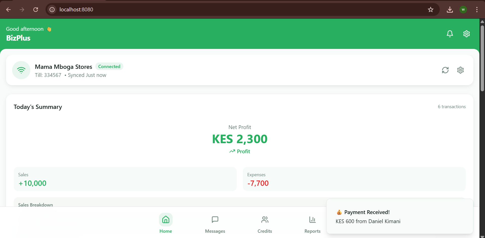
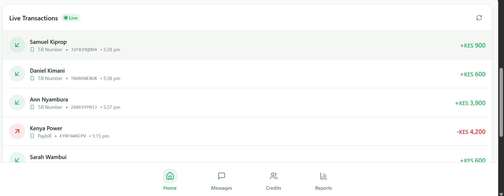
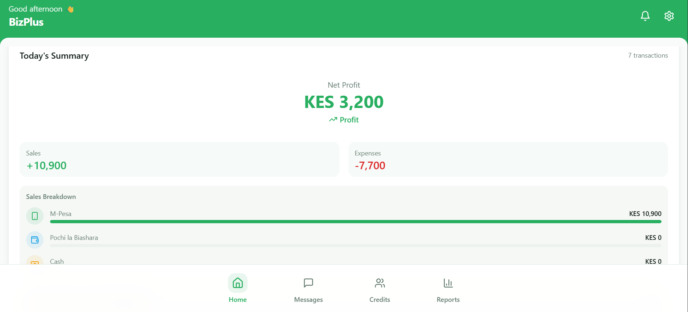
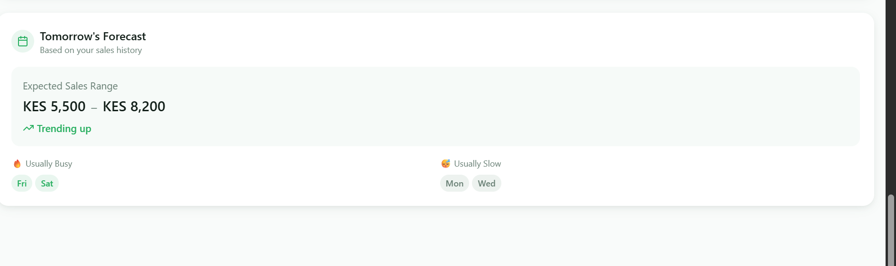
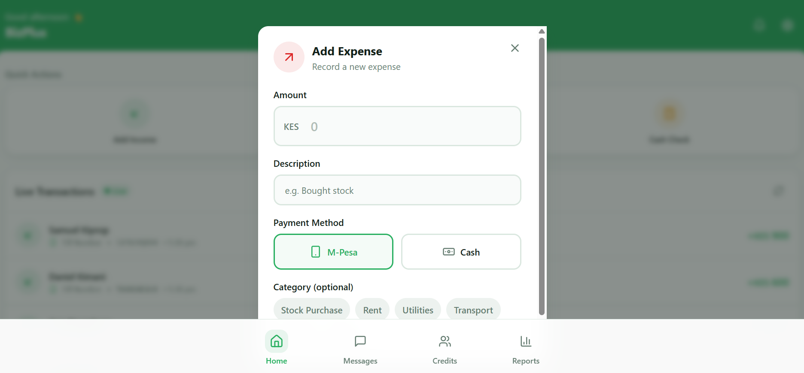

## BizPlus – Smart Money Tracking for Kenyan Small Businesses

BizPlus is a mobile app that helps Kenyan small and micro businesses track all their money in one place.  
It automatically records M‑Pesa transactions (Till, Paybill, and Pochi la Biashara), combines them with cash and expenses, and shows a clear daily profit so business owners can make faster, smarter financial decisions.

---

## 1. Problem & Solution

### Problem

- Kenyan SMEs rely heavily on M‑Pesa (Till, Paybill, Pochi la Biashara) and cash.
- Transactions are scattered across SMS messages, M‑Pesa statements, and paper receipts.
- Owners struggle to know: **“Did I really make a profit today?”**
- Manual record‑keeping is time‑consuming, error‑prone, and often ignored.

### Solution – BizPlus

BizPlus provides:

- **Automatic M‑Pesa tracking**: Reads and categorizes business M‑Pesa transactions.
- **Unified view of money**: Combines digital (M‑Pesa) and cash transactions in one dashboard.
- **Clear daily profit**: Calculates revenue, expenses, and net profit per day, week, and month.
- **Actionable insights**: Simple charts and summaries that non‑accountants can understand.

---

## 2. Key Features (with Screenshots)


- **Smart Dashboard – Daily Profit at a Glance**  
  - Shows today’s sales, expenses, and profit in one screen.  
  - Quick filters by day, week, and month.  

  

- **Automatic M‑Pesa Transaction Capture**  
  - Imports and categorizes transactions from Till, Paybill, and Pochi la Biashara.  
  - Separates customer payments, withdrawals, transfers, and charges.  

  

- **Cash & Expense Tracking**  
  - Record cash sales, petty cash, and expenses (rent, stock, salaries, etc.).  
  - Attach notes or categories for easier reporting.  

  

- **Simple Reports & Analytics**  
  - View profit trends over time.  
  - See top expense categories and best‑selling days.  

  

- **Multi‑User / Roles (if applicable)**  
  - Owner overview vs. staff access (e.g., sales‑only access).  

  

---

## 3. Live Demo / APK Download (Mandatory)


### Web Live Demo

- **App URL**: [BizPlus Web App](https://mbizplus.vercel.app)

- **Test Login – Owner**
  - Email/Phone: `0798111222`
  - Password: `111111`

- **Test Login – Staff**
  - Email/Phone: `0754723421`
  - Password: `121212`

### Android APK

- **Download APK**: [BizPlus APK on Google Drive](TODO_ADD_GOOGLE_DRIVE_APK_LINK_HERE)

- **Test Account – Owner**
  - Phone: `0765432512`
  - PIN/Password: `1111`

- **Test Account – Staff / Cashier**
  - Phone: `0754723421`
  - PIN/Password: `1212`

### Live Video Demo

- **Watch Demo**: [Live Video Demo](https://drive.google.com/drive/folders/1On3S1OdECnrS60rVDqzRKgjx1-7x0LQy?usp=sharing)


---

## 4. About BizPlus

BizPlus is built specifically for Kenyan small and micro businesses that depend on M‑Pesa for daily operations. The goal is to remove the complexity of accounting and give business owners an instant, honest view of how their business is performing.

**Core objectives:**

- **Automate** as much data entry as possible using M‑Pesa transaction data.
- **Unify** digital and cash transactions in a single, easy‑to‑understand view.
- **Explain** the numbers in plain language (sales, expenses, profit) instead of accounting jargon.
- **Empower** business owners to make decisions based on real‑time financial health.

Typical users include kiosk owners, small retail shops, boda boda operators, mama mbogas, and freelancers who receive payments via M‑Pesa.

---

## 5. Tools, Technologies & Frameworks Used


- **Frontend / Mobile**
  - Framework: `React Native / Flutter / Native Android / Kotlin`
  - UI Components: `React Native Paper / Material Design / Tailwind CSS / custom`

- **Backend & APIs**
  - Backend: `Node.js with Express / Django / Laravel / Firebase / Supabase`
  - Database: `PostgreSQL / MySQL / MongoDB / Firebase Firestore / SQLite`
  - Authentication: `JWT / Firebase Auth / custom auth`
  - M‑Pesa Integration: `Safaricom Daraja API / SMS parsing / other`

- **DevOps & Infrastructure**
  - Hosting: `Vercel / Netlify / Render / Railway / AWS / GCP / Azure`
  - CI/CD: `GitHub Actions / none`

- **AI / Data Tools (if applicable)**
  - AI Models / APIs: `OpenAI / Gemini / Anthropic`  
  - Analytics: `rule‑based insights / ML models for trends`

- **Development Tools**
  - Languages: `TypeScript / JavaScript / Dart / Java / Kotlin / Python`
  - Package Managers: `npm / yarn / pnpm / pip`
  - Design: `Figma / Canva` for UI/UX and mockups.

---

## 6. Collaborators & Roles


- **Edith Karanja –  Full‑Stack Developer**  
  - Responsibilities: overall architecture, core features, integrations, coordination.

- **Wendy Atieno – Backend Developer / DevOps**  
  - Responsibilities: API design, database, deployment, M‑Pesa integration.

- **Sheila Chesire – Frontend Engineer**  
  - Responsibilities: UI implementation, navigation, state management, UX.

- **Wesley Njenga – Product / UX / Research**  
  - Responsibilities: user research, flows, testing with SMEs, documentation.

- **Contributors**
  - `Wendy Atieno` 
  - `Edith Karanja`
  - `Sheila Chesire`

---

## 7. Getting Started


### Prerequisites

- (e.g. Node.js / Java / Flutter SDK, depending on your stack).
- Android Studio or a physical Android device for running the APK.

### Installation

```bash
# Clone the repository
git clone https://github.com/edithcalm/BizPlus.git
cd BizPlus

# Install dependencies (example for a JavaScript/TypeScript project)
npm install

# Configure environment variables
# Copy .env.example to .env and fill in your Supabase project URL + anon key

# Run the app
npm run dev
```

---

## 9. Supabase Setup (Required for real user saving)

This frontend uses **Supabase Auth + Supabase Postgres** to persist users.

### Create the `profiles` table

Run this SQL in Supabase (SQL Editor):

```sql
create table if not exists public.profiles (
  id uuid primary key references auth.users(id) on delete cascade,
  phone text not null,
  role text not null check (role in ('owner', 'staff')),
  created_at timestamptz not null default now()
);

alter table public.profiles enable row level security;

-- Allow a signed-in user to create/update their own profile row
create policy "profiles_upsert_own"
on public.profiles
for insert
to authenticated
with check (auth.uid() = id);

create policy "profiles_update_own"
on public.profiles
for update
to authenticated
using (auth.uid() = id)
with check (auth.uid() = id);

create policy "profiles_select_own"
on public.profiles
for select
to authenticated
using (auth.uid() = id);
```

### Configure Auth

- In Supabase Dashboard → Authentication → Providers:
  - Enable **Email** provider (password auth).
  - For local demo, you may want to disable email confirmations (optional).


## 8. License (Optional)


`TODO_ADD_LICENSE_INFO_HERE (e.g. MIT License)`
